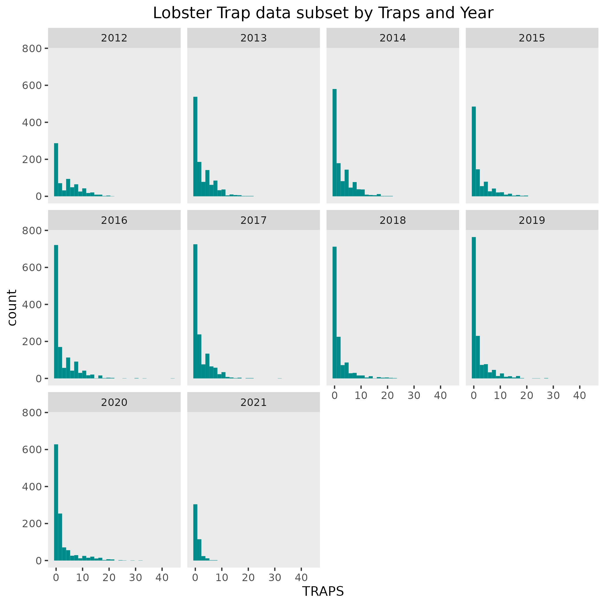

```{r setup, include=FALSE }
knitr::opts_chunk$set(echo = TRUE)
```

## NEW NEW
Reminder: be in the correct branch!

```{r libraries}
library(readr)
library(dplyr)
library(ggplot2)
library(tidyr)
```

```{r read in data}
lobster_abundance <- read_csv("../data/Lobster_Abundance_All_Years_20220829.csv")
```

```{r}
lobster_abundance <- lobster_abundance %>% 
    mutate(SIZE_MM = na_if(SIZE_MM, -99999))

not_napl <- lobster_abundance %>% 
    filter(SITE != "NAPL")

aque_70mm <- lobster_abundance %>% 
    filter(SITE == "AQUE", SIZE_MM >= 70)
```


```{r}
ggplot(data = lobster_abundance, aes(x = SIZE_MM)) +
    geom_histogram() +
    facet_wrap(~SITE)

lobsters_summarize <- lobster_abundance %>% 
  group_by(SITE, YEAR) %>% 
  summarize(COUNT = n())

ggplot(data = lobsters_summarize, aes(x = YEAR, y = COUNT)) +
  geom_point(aes(color = SITE)) +
  geom_line(aes(color = SITE)) 
```


# Citation of the data
Lobster data accessed at [this link](https://portal.edirepository.org/nis/mapbrowse?packageid=knb-lter-sbc.77.8) on April 5, 2023.

# Abstract of data
Data on abundance, size and fishing pressure of California spiny lobster (Panulirus interruptus) are collected along the mainland coast of the Santa Barbara Channel. Spiny lobsters are an important predator in giant kelp forests off southern California. 


# Owner analysis and visualizations


# Collaborator visualization 

