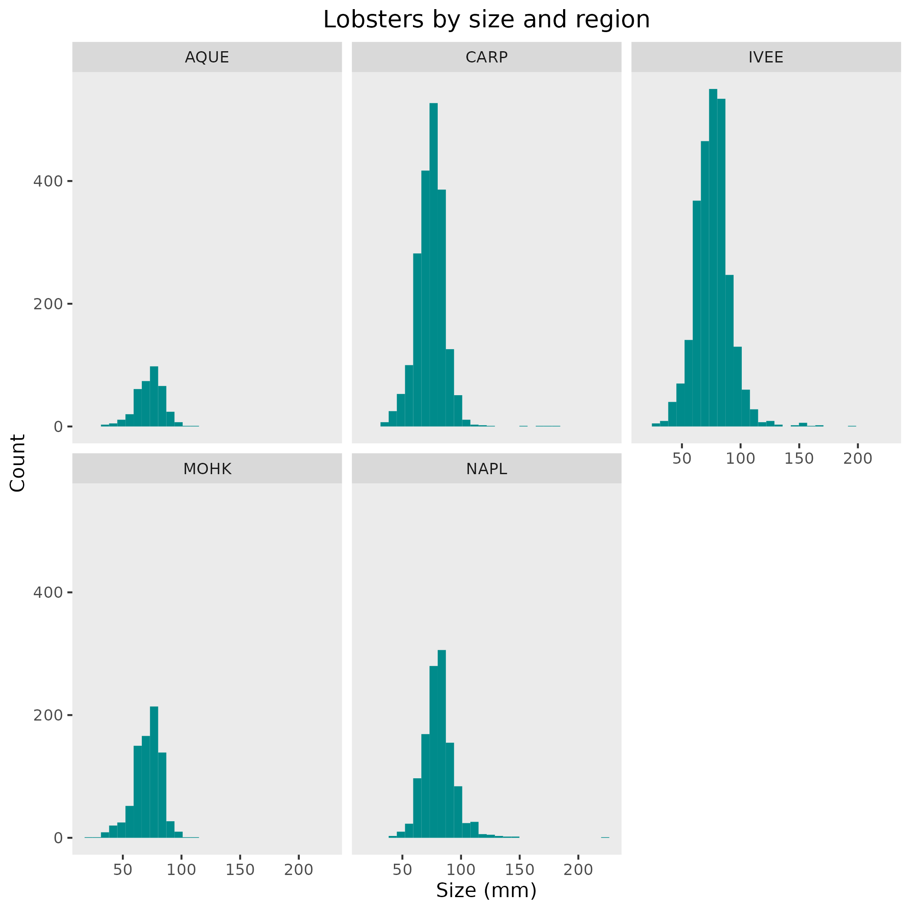

```{r setup, include=FALSE}
knitr::opts_chunk$set(echo = TRUE)
```

#Citation of the data
Lobster data accessed at [this link](https://portal.edirepository.org/nis/mapbrowse?packageid=knb-lter-sbc.77.8) on April 5, 2023.

Data on abundance, size and fishing pressure of California spiny lobster (Panulirus interruptus) are collected along the mainland coast of the Santa Barbara Channel. Spiny lobsters are an important predator in giant kelp forests off southern California. 


#Owner analysis and visualizations (you choose which plots you want to include)



```{r}

```


add alternative text to your plots
plots can be added either with the data visualization code or with Markdown syntax - it’s up to you if you want to include the code or not.
-Collaborator analysis and visualizations (you choose which plots you want to include)
add alternative text to your plots
plots can be added either with the data visualization code or with Markdown syntax - it’s up to you if you want to include the code or not.